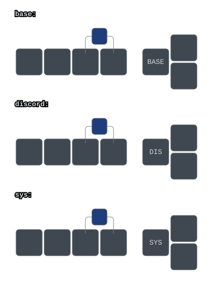
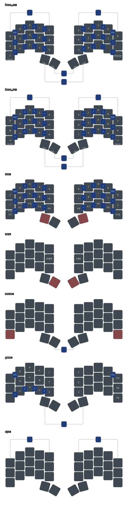
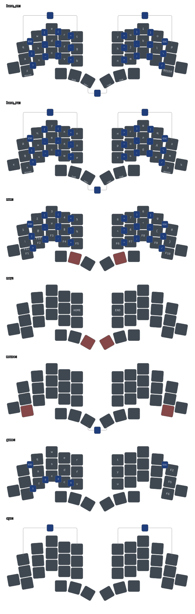
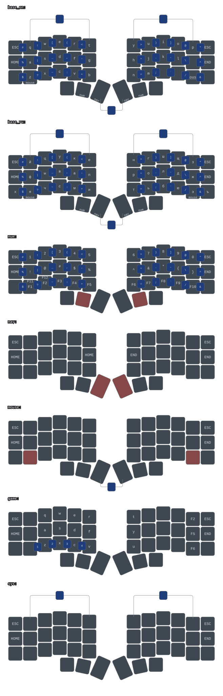
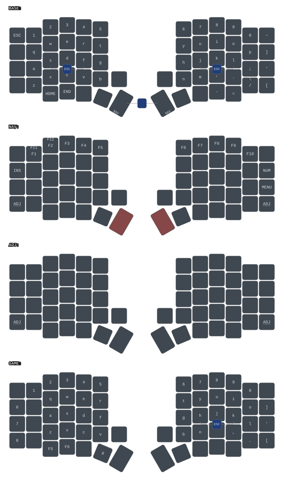

# ZMK-Config for my keebs

## [Nuke Pad](https://github.com/Fliegende-Rehe/zmk-config/tree/main/boards/shields/nuke_pad)

## [Chonky Bois](https://github.com/sanderboer/chonkybois)

## [Totem](https://github.com/GEIGEIGEIST/TOTEM)

## [Enki42](https://www.reddit.com/r/ErgoMechKeyboards/comments/qeq2qg/enki42_slim_ergo_keyboard/)

<!-- ## [Sofle V2 RGB](https://github.com/josefadamcik/SofleKeyboard)

 -->
